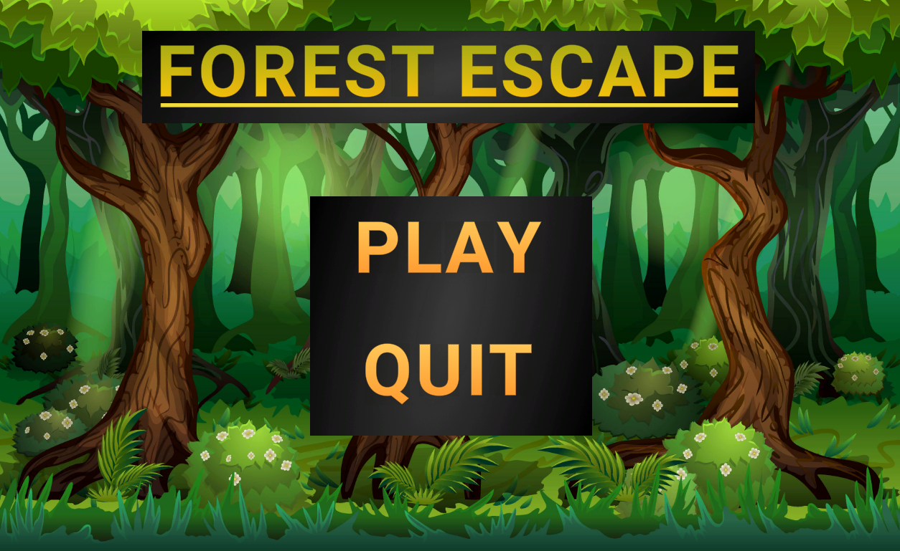
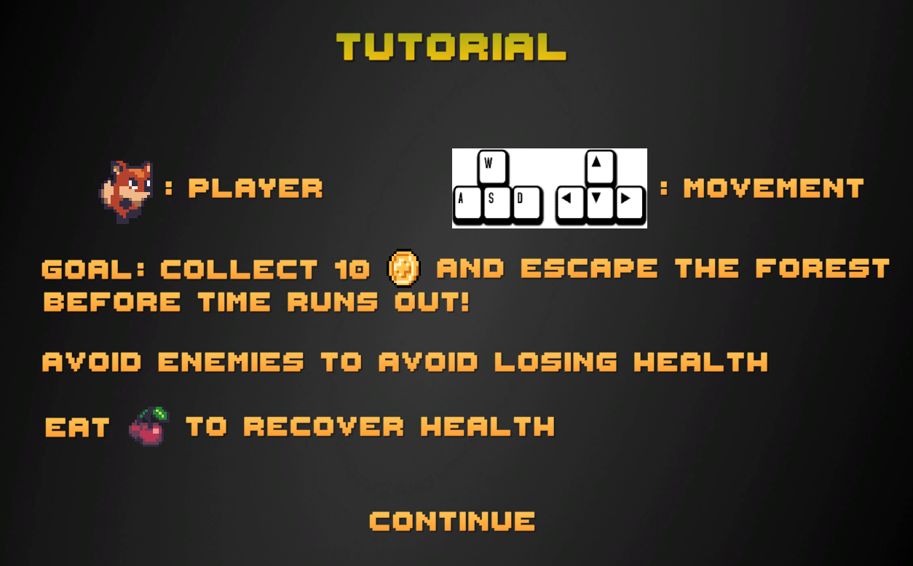
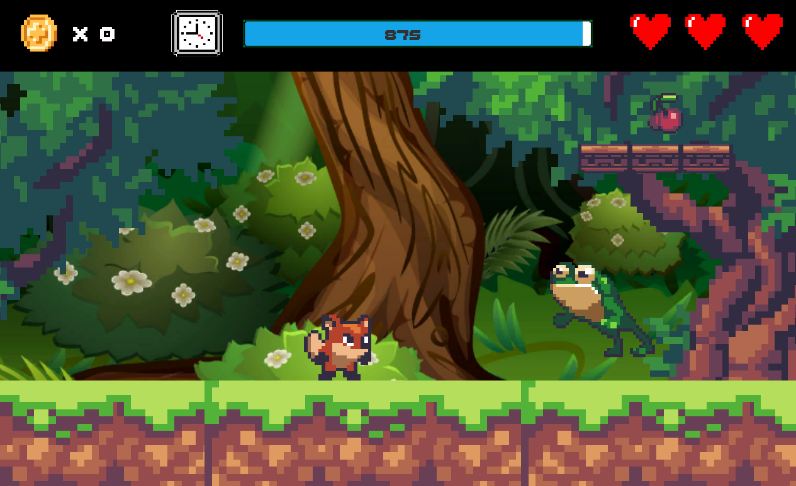
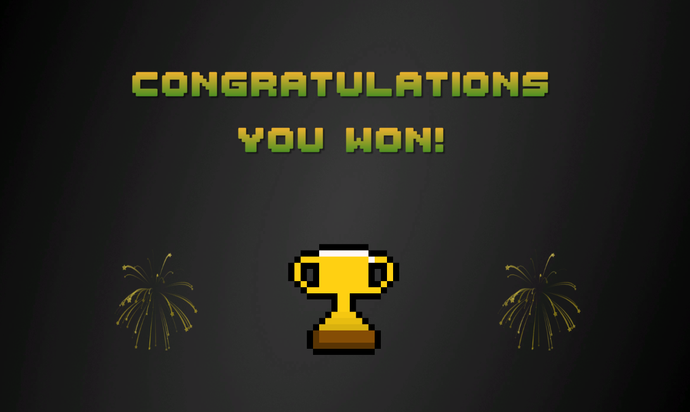
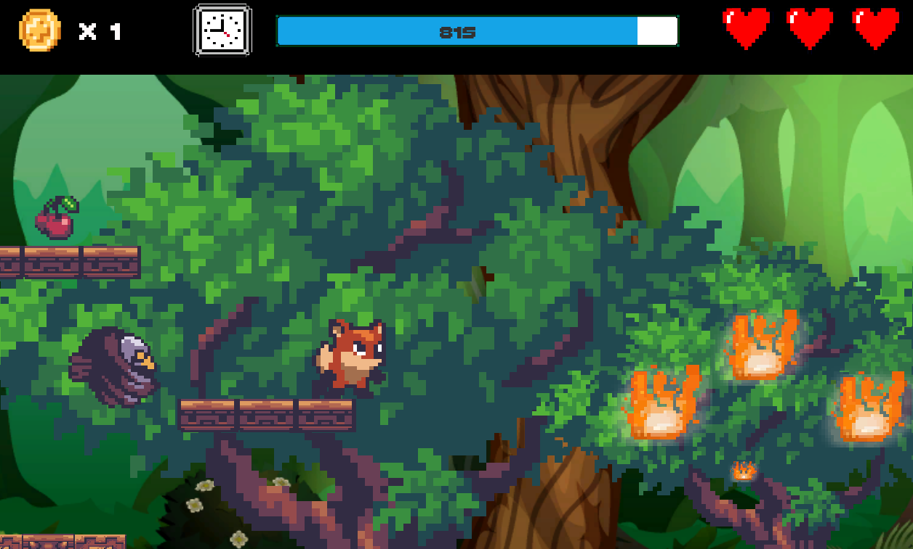
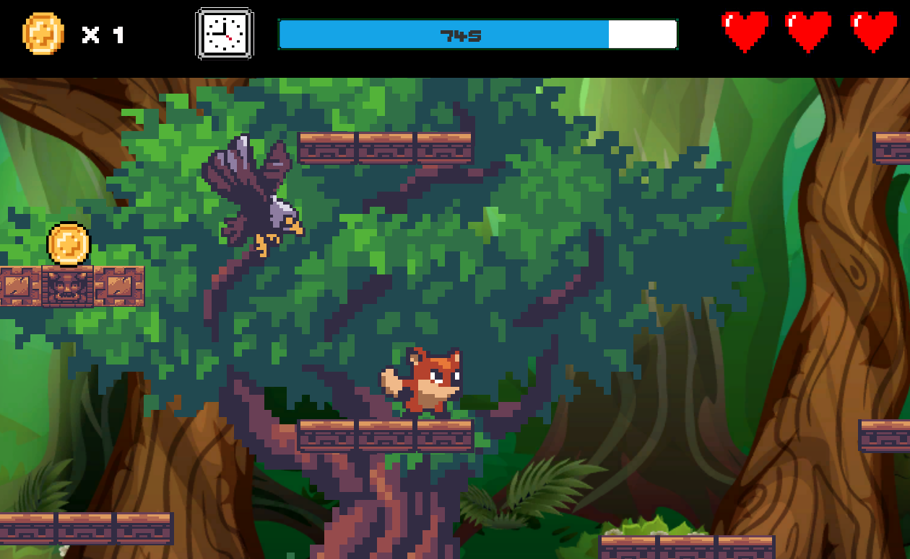

Christopher Duarte
 
 05/06/2020 
  
<h2 align = center><u> Forest Escape </u></h2>

### Game Summary

Forest Escape is a traditional 2D platformer that features elements such as multiple platforms, chasing, patrolling, and environmental enemies, and a focus on a smooth user experience. Several characteristics of Forest Escape include jumping, platform traversal, camera follow, objectives, and multiple endgame states (winning and losing). The defining aspects of Forest Escape include the overall user experience and chasing enemies which make use of the `A* search algorithm` to heuristically generate the shortest path to the player. Additional features include health mechanics, time bar, and collectibles. The premise of Forest Escape is simple, a fox must escape a burning forest, but before doing so, it must collect ten coins and then will be able to escape the forest. The game will be primarily playable online using a WebGL build and features keyboard controls to allow player movement. The base game is single player, but a multiplayer scoreboard feature may be implemented, if time permits, in the future. 

### Game Genre

Forest Escape is traditional 2D Platfomer with a focus on enemy AI and smooth user experience. Several inspirations for this game include Shovel Knight (Gameplay/Graphics), Cuphead (Gameplay), and Stardew Valley (Graphics).

### Game Story/Plot

The story of Forest Escape is simple. A fox must escape a burning forest, but before doing so, it must collect ten coins. Once the ten coins are collected, it will be allowed to leave the forest. As such, the main game revolves around a forest with several trees and areas that are seen to be ablaze. Sound in Forest Escape plays a key role through background music, reverb zones (fires), and reactionary sounds like chomping (eating cherries), coins clinking (collecting coins), and grass stepping (moving through grass).

### Control Scheme

Forest Escape can be played online utilizing a WebGL build and utilizes a keyboard control scheme for the player character. Keyboard (WASD keys or Arrow keys) is used for four directional movement, which includes jumping. There is no mechanic implemented towards defeating enemies, only avoiding enemies will help in accomplishing the main objective of collecting the coins and escaping the forest. A demonstration of the game is as follows:

#### Starting Menu

#### Game Tutorial

#### Level Demo

#### Game Over Screen

#### Win Screen

### User Progression

The player controls the fox trying to escape the forest, by first collecting the ten coins. He/She advances in this goal by moving left or right in the level, as is typical in 2D Platformers. But don't be fooled by the simplicity of the task, Forest Escape is not designed to be easy. This is demonstrated in that the enemies cannot be killed and the player must adjust accordingly in order to collect the coins and escape the forest. The player may do this by jumping on platforms and trees to reach the next coin, but be careful as some enemies can adjust to your position and may follow you relentlessly.

Forest Escape (as of the creation of this document) only features one main level of gameplay, but more scenes are included as part of user interface and experience. Once the player completes a game, he/she is brought to a game completion screen and then back to the main menu. If he/she fails in completing the main objective of the game, the player is brought back to a game over screen and shortly taken to the starting menu to attempt escaping the forest again. 

### Game AI

Forest Escape features three unique enemy types: patrol enemies, chasing enemies, and environmental enemies. Patrol Enemies are represented as frogs which display a back and forth jumping mechanic within a designated area. Chasing enemies are represented by flying birds with chase the player once he/she enters the bird's vicinity by utilizing `A* search algorithm`. Environmental enemies are represented by fires that are found throughout the burning forest level. Each of these enemies deals half a heart of health upon being touched. This damage is subtracted from a total of three hearts which results in 6 total times you can be hit throughout an attempt while traversing the level. If damage is taken, half a heart can be recovered by eating cherries that are strewn about the level, thus resulting in more times a player can be hit before initiating game over. 

### Network Component

The base game of Forest Escape does not have any network component implemented. But the next update will feature a multiplayer score board for those who wish to compete in completing the level fastest. 

### Sample Screen Shots

### References

- Many of the assets utilized in the creation of this game are not my own. I was able to find them for free on the internet. **I do not plan to utilize this game in any commercial aspect.**
- My effort in this project is represented mainly in making the actual game in relation to programming, animations, providing functionality, and generating the smooth user experience that is expected in a game. 
- Sources (what was obtained in parenthesis):
  - https://assetstore.unity.com/packages/2d/characters/sunny-land-103349 (Sprites)
  - https://www.myinstants.com/instant/final-fantasy-victory-fanfare/ (Winning Game Music)
  - https://patrickdearteaga.com/ (Music)
  - https://www.fesliyanstudios.com/royalty-free-sound-effects-download/footsteps-on-grass-284 (Grass Sound Effect)
  - https://www.freesoundeffects.com/free-sounds/fire-10007/ (Fire Sound Effects)
  - https://www.youtube.com/user/Brackeys (Tutorials)
  - https://youtu.be/mJXiMOjTrO4 (Frog AI Tutorial)
  - https://youtu.be/1PXumKWrxpw (Frog AI Tutorial)
  - https://arongranberg.com/astar/ (A* Pathfinding in Unity)
  - https://youtu.be/bcvLM_riVuw (Timer Tutorial)
  - https://www.pngkit.com/view/u2q8y3i1a9w7u2r5_22-color-coin-sprite-sheet-png/ (Coin Sprite)
  - https://ya-webdesign.com/imgdownload.html (Heart Sprites)
  - https://www.pikpng.com/pngvi/iTbJbTh_brokenheart-black-heart-pixel-art-clipart/ (Broken Heart Sprite)
  - https://www.pngfind.com/download/hRRbTih_pvp-trophy-sans-undertale-8-bit-hd-png/ (Trophy Sprite)
  - https://opengameart.org/content/fireworks-effect-spritesheet (Firework Sprites)
- These were all the sources that I utilized in my project. But if there are any I left out, they can be found in my previous project assignments. 

